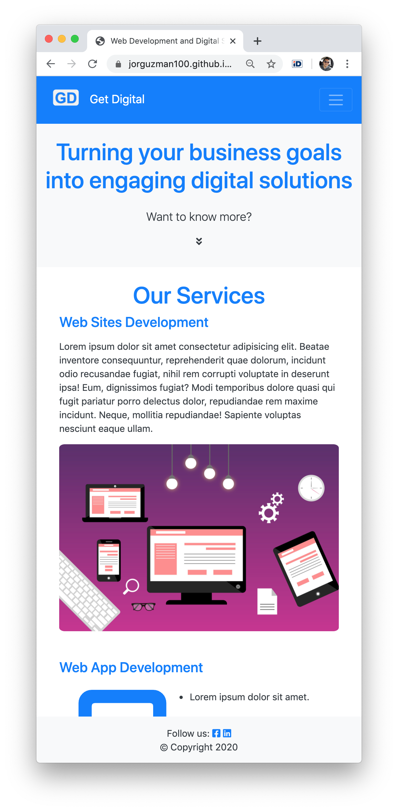
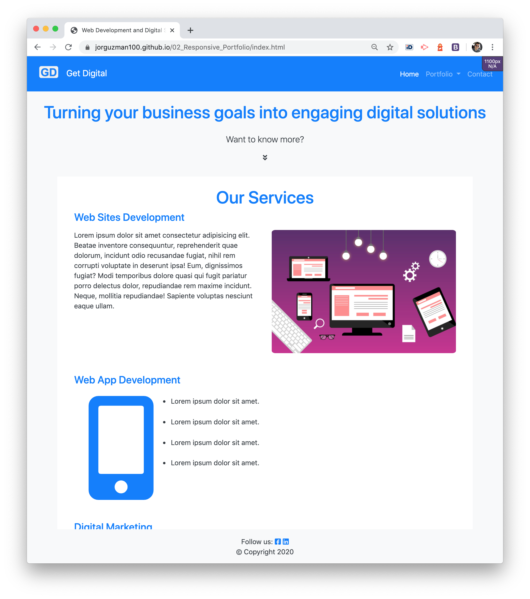
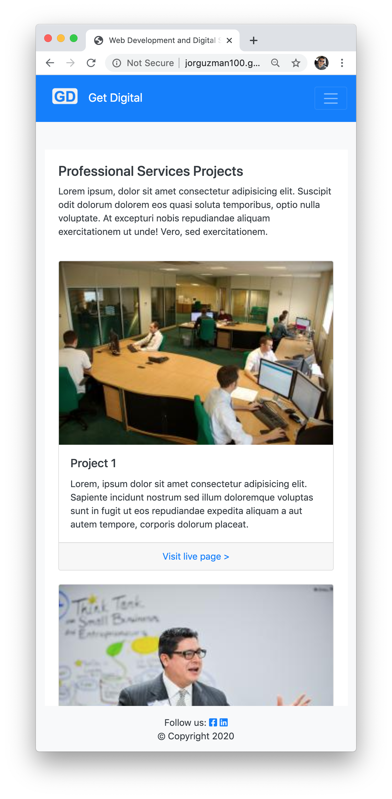
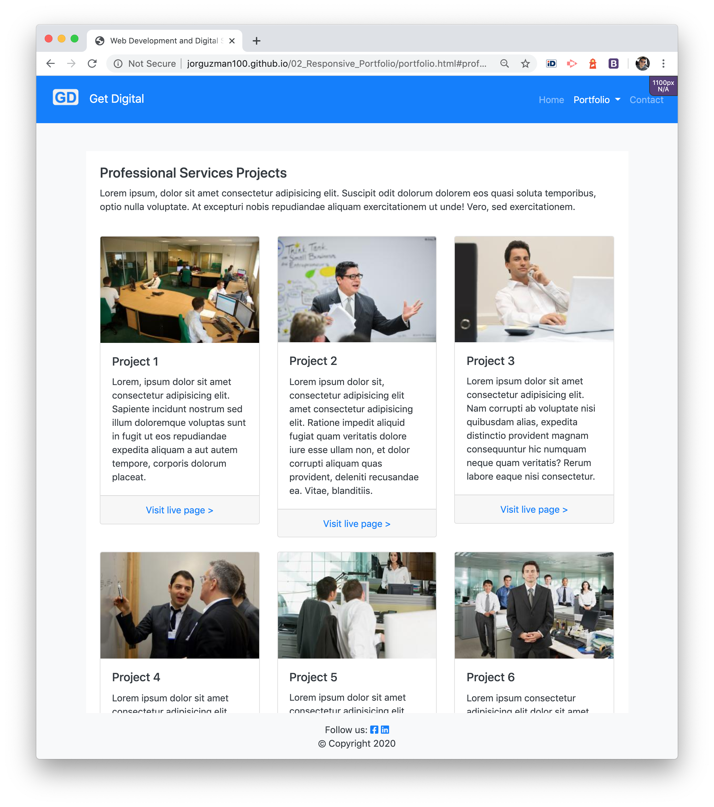
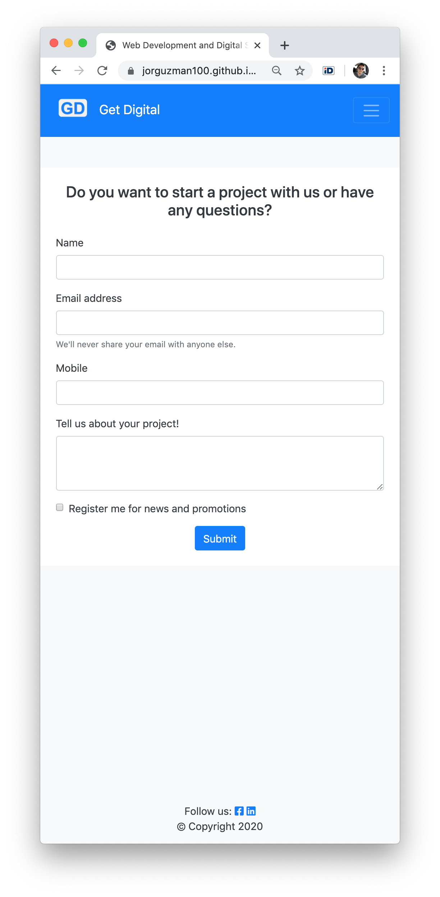
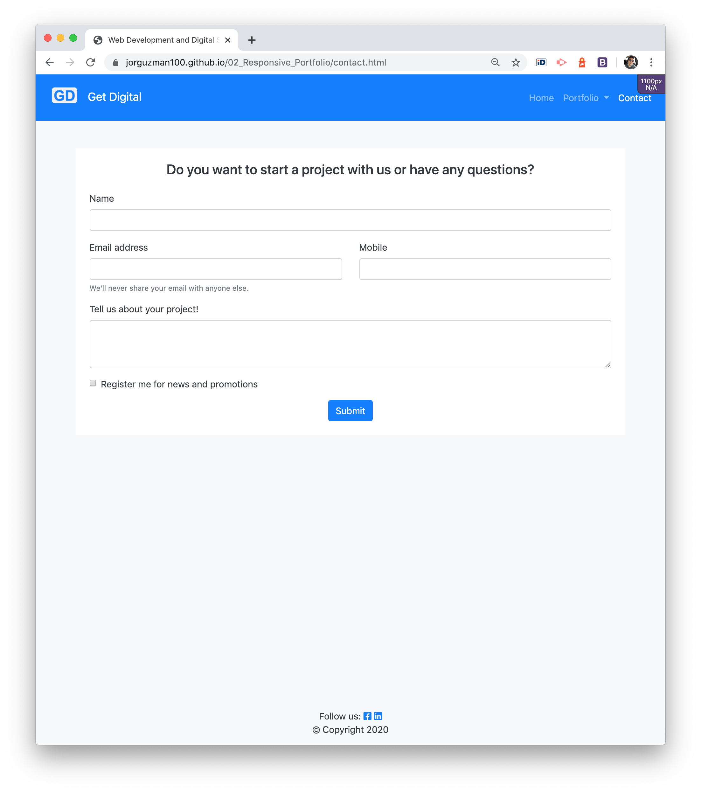

# 02_Responsive_Portfolio
A Web Development and Digital Marketing Agency Portfolio. \
Built with HTML, CSS, JavaScript and Bootstrap library.

## The Challenge
***
The author is interested on launching a Web Development and Digital Marketing Agency. For this purpose, it is requiered to have a Portfolio website where the best example projects are shown.

The portfolio will integrate the following development best practices and characteristics:
- [x] Design and develop with the Mobile-First approach.
- [x] Apply Responsive Layout and images, for larger screen sizes.
- [x] Utilize Bootstrap Components and Grid System.
- [x] Use of Semantic HTML.
- [x] Confirm valid HTML with an external validation service.

Additional requirements:
- [x] Functional, deployed application
- [x] GitHub repository with README describing the project
- [x] Navbar consistent on each page.
- [x] Navbar on each page must contain links to Home/About, Contact, and Portfolio pages.
- [x] All links must work.
- [ ] Must contain your personalized information. (bio, name, images, links to social media, etc.)

Note. The last point was adjusted considering this project is for a company portfolio instead of a personal web developer portfolio.

## The  development process
***
In order to accomplish the challenge, the following steps were executed:
- Define the purpose and plan the general idea of the site.
- Sketch the pages and main sections, considering two stages:
  - Mobile-first approach.
  - Responsive design for larger screen sizes.
- Create the base-line layout and grid.
- Search for assets (images, icons, logo, etc.)
- Integrate assets to the layout.
- Add basic functionality like links, navigation bar and dropdown group.
- Add minimum CSS adjustments.
- Apply semantic HTML.
- Asses valid HTML.
- Final review and proper documentation.

## The sketches
***
__Mobile-first approach__

__Larger Screens__

## The Output
***
With the research and application of concepts, we were able to create a responsive portfolio base-line. 
As new projects are developed, they will be included into the portfolio.
Additional functionality and style will be included in further stages.

The portfolio is integrated by the following pages and sections:
- Home
  - Our Services
  - A business Mindset
  - Features
  - Why us
- Portfolio
  - Professional Services
  - Local Services
  - E-Commerce
  - Local Commerces
  - Startups
  - Non-profit Projects
- Contact

Home page
 

Portfolio page

Contact page

## Installation
***
The project was uploaded to [GitHub](https://github.com/) at the following repository:
[https://github.com/jorguzman100/02_Responsive_Portfolio](https://github.com/jorguzman100/02_Responsive_Portfolio)

You can access the deployed application with the GitHup Pages link:
[https://jorguzman100.github.io/02_Responsive_Portfolio/](https://jorguzman100.github.io/02_Responsive_Portfolio/)

## Tools and other References
***
[Bootstrap](https://getbootstrap.com/)

[Balsamiq](https://balsamiq.com/)

[Font Awesome](https://fontawesome.com/)

[Canvas](https://www.canva.com/)

[Placeholder](https://placeholder.com/)

[Random images](http://lorempixel.com/)

[Lorem Ipsum](www.lipsum.com)

[HTML Color Picker](https://www.w3schools.com/colors/colors_picker.asp)

[A Complete Guide to Flexbox](https://css-tricks.com/snippets/css/a-guide-to-flexbox/#flexbox-background)

[Markup Validation Service](https://validator.w3.org/)

[Semantic HTML](https://teamtreehouse.com/library/semantic-html-header-footer-and-section)

## Aknowledgements
***
I appreciate the guide and support from Diana and Fernanda.
